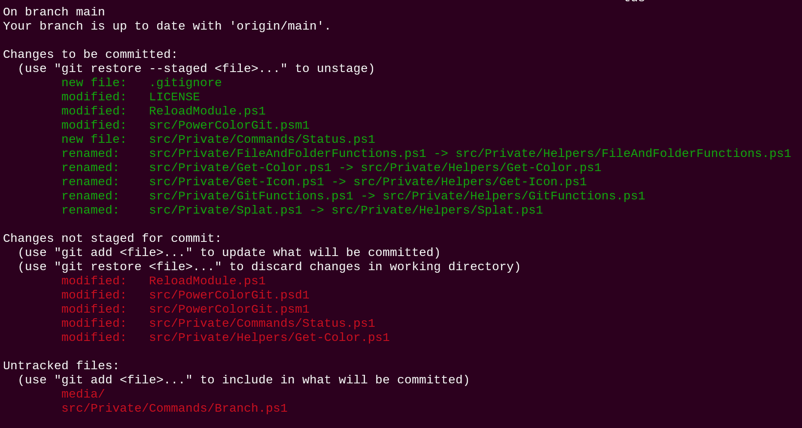
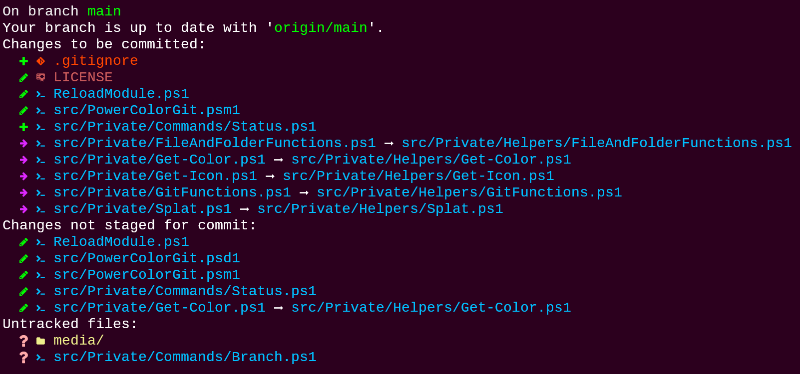

# PowerColorGit

A Powershell module that improves on the git command line experience with colorized output with icons as well as an easier branch selection experience.

## Overview #

*PowerColorGit* is a Powershell module that improves on the git command line experience with simplified and colorized output and simplified branch selection.
For the module to work, you must first install [Terminal-Icons](https://github.com/devblackops/Terminal-Icons/) and setup the [Nerd Fonts](https://github.com/ryanoasis/nerd-fonts/)

The module provides enhancements to the _git status_ _git branch_ and _git checkout_ commands.

For example, this is how the standard output of git status can look like:



With PowerColorGit you instead get this output:



PowerColorGit will also fallback to default behaviour when an option or command is not specifically implemented in PowerColorGit, so you can use commands like _PowerColorGit clone_, _PowerColorGit push_ or _powercolorgit status --short_ even though nothing is implemented in PowerColorGit for these.

## Installation
Work in progress

## Example usage
```powershell
Import-Module PowerColorGit
PowerColorGit status
PowerColorGit branch
PowerColorGit branch -a
PowerColorGit checkout partalbranchname
```

List the current working tree status
```powershell
PowerColorGit status
```
TODO: Add screenshot

List all remote-tracking and local branches
Please note that the HEAD branch will by default not be displayed in PowerColorGit. You can change this in the configuration.
```powershell
PowerColorGit branch -a
```
TODO: Add screenshot

## Configuration
In the file [config.json](./src/config.json) you will find some configuration options for PowerColorGit.

## Alias to pcg
Warning. Do not alias to **git** since PowerColorGit uses the git command internally and this would cause the module to call itself.
```powershell
Set-Alias -Name pcg -Value PowerColorGit -Option AllScope
```
